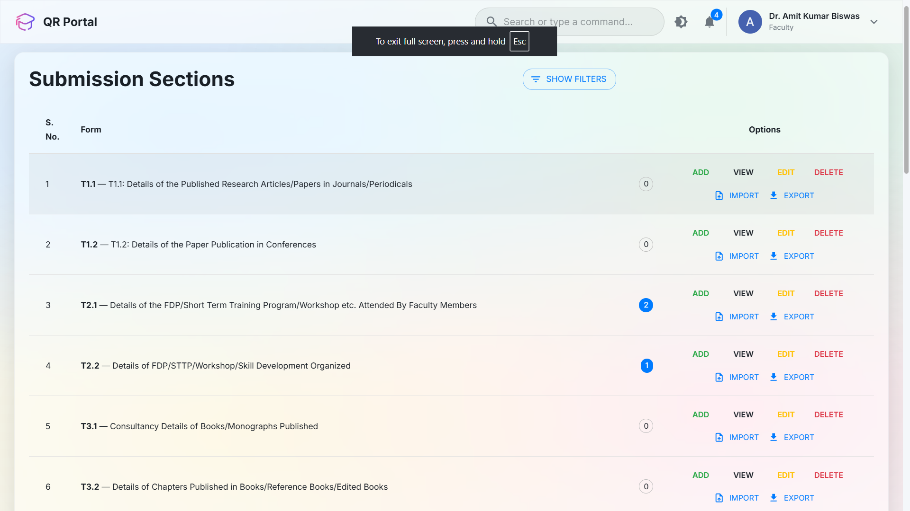
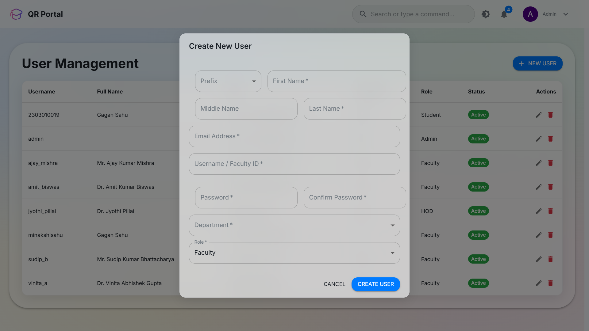
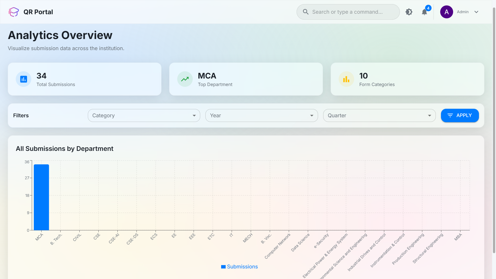
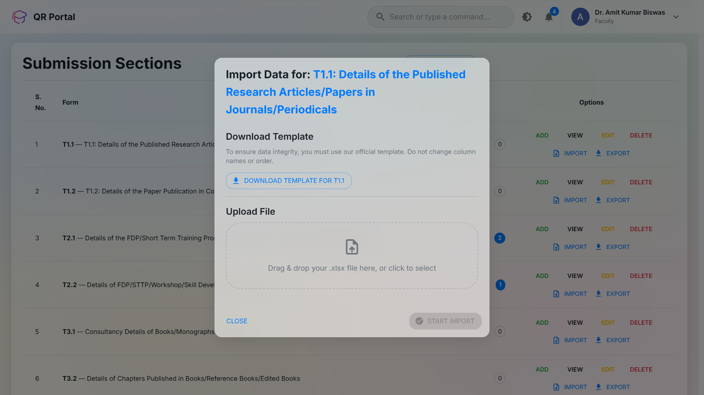
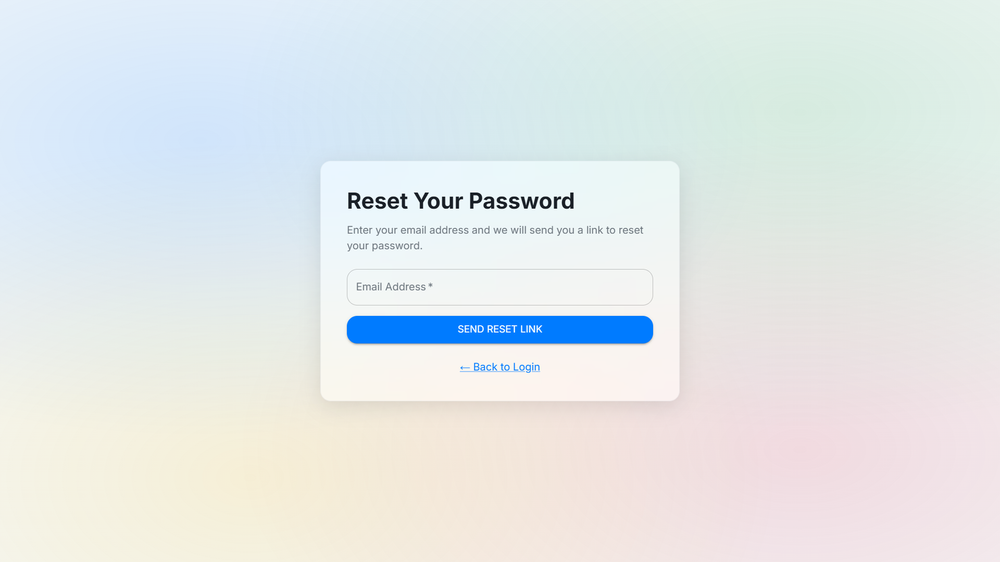

# Quarterly Report Portal for BIT Durg

<p align-center">
  
</p>

<p align="center">
  A professional-grade, full-stack web application designed to streamline and automate the academic quarterly reporting process for the <strong>Bhilai Institute of Technology, Durg</strong>.
  <br />
  <br />
  
  
  
  
  
</p>

## Table of Contents

- [About The Project](#about-the-project)
- [Key Features](#-key-features)
- [✨ Feature Showcase](#-feature-showcase)
- [Technology Stack](#-technology-stack)
- [Getting Started](#-getting-started)
  - [Prerequisites](#prerequisites)
  - [Backend Setup](#1-backend-setup)
  - [Frontend Setup](#2-frontend-setup)
- [Environment Variables](#-environment-variables)
- [Running Tests](#-running-tests)
- [API Overview](#-api-overview)
- [User Roles & Usage](#-user-roles--usage)
- [Contributing](#-contributing)
- [License](#-license)

---

## About The Project

This portal provides a secure, role-based system for faculty to submit academic and research data, for Heads of Department (HODs) to oversee departmental submissions, and for administrators to manage the entire system and derive key analytics. The application is built with a modern, decoupled architecture, featuring a Django REST Framework backend and a React (Vite) frontend.

---

## Key Features

This project incorporates a range of industry-standard features with a focus on security, scalability, and user experience.

-   **🔐 Role-Based Access Control (RBAC):** Four distinct user roles (**Faculty**, **HOD**, **Admin**, **Student**) with tailored permissions and dashboard views.
-   **📝 Dynamic Form System:** A highly scalable system that dynamically generates over 40 unique data submission forms from a central configuration, adhering to the DRY principle.
-   **📊 Bulk Data Management:** A template-driven **Excel import/export system** with intelligent validation to handle large datasets efficiently and safely.
-   **⚙️ Complete Admin Dashboard:** Dedicated UIs for administrators to perform full CRUD operations on user accounts and academic departments.
-   **🔍 Advanced Filtering & Search:** Powerful filtering panels for admins and faculty to sort submission data by academic session, department, or individual faculty member.
-   **🛡️ Secure User Onboarding:**
    -   **Email Verification:** New users must verify their email via a secure, one-time link before their account is activated.
    -   **Forced Password Change:** Staff users are required to change their admin-provided password on their first login.
-   **🔑 Secure Password Recovery:** A full self-service workflow for users to securely reset their forgotten passwords via email.
-   **⚡ Token-Based Authentication:** Secure JWT (JSON Web Token) authentication with automated silent token refresh for a seamless user session.
-   **🎨 Modern, Responsive UI:** A polished UI built with Material-UI that is fully responsive and supports both **light and dark modes**.
-   **📈 Analytics & Visualization:** A dedicated analytics dashboard for admins to view aggregated data with interactive charts.

---

## ✨ Feature Showcase

#### Role-Based Dashboards
*The UI and available forms adapt based on whether the user is a Faculty, Student, or Admin.*

<!-- 
    PLACEHOLDER INSTRUCTION:
    Take a screenshot of the main dashboard when logged in as a Faculty/HOD.
    Replace the path below.
-->


<br/>

#### Centralized User Management
*Admins have a dedicated interface to manage all user accounts, roles, and statuses.*

<!-- 
    PLACEHOLDER INSTRUCTION:
    Take a screenshot of the User Management table in the admin panel.
    Replace the path below.
-->


<br/>

#### Interactive Analytics
*Admins can visualize submission data with interactive charts and dynamic filters.*

<!-- 
    PLACEHOLDER INSTRUCTION:
    Take a screenshot of the Analytics Dashboard page, showing the charts.
    Replace the path below.
-->


<br/>

#### Intelligent Excel Import Wizard
*A guided, template-driven workflow ensures data integrity during bulk uploads.*

<!-- 
    PLACEHOLDER INSTRUCTION:
    Take a screenshot of the "Import Data" dialog box.
    Replace the path below.
-->


<br/>

#### Secure Onboarding & Password Recovery
*Users are guided through secure processes for account activation and password resets.*

<!-- 
    PLACEHOLDER INSTRUCTION:
    Take a screenshot of either the "Force Password Change" page or the "Forgot Password" page.
    Replace the path below.
-->


---

## Technology Stack

| Area                   | Technology                                     |
| ---------------------- | ---------------------------------------------- |
| **Backend**            | Django, Django REST Framework                  |
| **Frontend**           | React 18, Vite                                 |
| **Database**           | PostgreSQL                                     |
| **UI Library**         | Material-UI (MUI) v5                           |
| **Authentication**     | Simple JWT (JSON Web Token)                    |
| **API Communication**  | Axios (with interceptors for token management) |
| **Form Management**    | React Hook Form, Yup, Zod                      |
| **Data Handling**      | OpenPyXL (Backend), File-Saver, React-Dropzone |
| **Data Visualization** | Recharts                                       |

---

## 🚀 Getting Started

To get the project running locally, you will need to set up the backend and frontend separately.

### Prerequisites

Make sure you have the following software installed on your machine:

  * **Python** (3.8 or newer)
  * **Node.js** (v18 or newer) & **npm**
  * **PostgreSQL** (v12 or newer)

### 1\. Backend Setup

First, set up the Django API server.

```bash
# 1. Navigate to the backend directory
cd backend

# 2. Create and activate a virtual environment
python -m venv env
source env/bin/activate  # On Windows: env\Scripts\activate

# 3. Install dependencies
pip install -r requirements.txt

# 4. Set up the environment file
# Rename .env.example to .env and fill in your details
cp .env.example .env

# 5. Run database migrations to create the tables
python manage.py makemigrations
python manage.py migrate

# 6. Create a superuser to access the admin panel and create other users
python manage.py createsuperuser

# 7. Start the server
python manage.py runserver
```

The backend API will now be running at `http://127.0.0.1:8000`.

### 2\. Frontend Setup

In a new terminal, set up the React client.

```bash
# 1. Navigate to the frontend directory
cd frontend

# 2. Install dependencies
npm install

# 3. Set up the environment file (if needed, defaults are provided)
# Rename .env.example to .env
cp .env.example .env

# 4. Start the development server
npm run dev
```

The frontend application will now be running at `http://localhost:5173`.

---

## 🔑 Environment Variables

You must create a `.env` file in the `/backend` directory. Below is a description of the required variables.

#### Backend (`/backend/.env`)


| Variable              | Description                                          | Example                       |
| --------------------- | ---------------------------------------------------- | ----------------------------- |
| `SECRET_KEY`          | A secret key for a Django installation.              | `'your-super-secret-key'`     |
| `DEBUG`               | Django debug mode. Set to `False` in production.     | `True`                        |
| `ALLOWED_HOSTS`       | Hosts/domains the Django app can serve.              | `127.0.0.1,localhost`         |
| `DB_NAME`             | Your PostgreSQL database name.                       | `quarterly_report_db`         |
| `DB_USER`             | Your PostgreSQL username.                            | `postgres`                    |
| `DB_PASSWORD`         | Your PostgreSQL password.                            | `db_password`                 |
| `DB_HOST`             | Database host.                                       | `localhost`                   |
| `DB_PORT`             | Database port.                                       | `5432`                        |
| `CORS_ALLOWED_ORIGINS`| The frontend URL for CORS.                           | `http://localhost:5173`       |
| `EMAIL_HOST_USER`     | Your Gmail address for sending verification emails.  | `your.email@gmail.com`        |
| `EMAIL_HOST_PASSWORD` | Your Gmail App Password (not your regular password). | `your_app_password`           |

---

## 🧪 Running Tests

The backend includes a suite of tests to ensure the reliability of the user authentication and management system. To run these tests, navigate to the `/backend` directory and run:

```bash
# Ensure your virtual environment is activated
python manage.py test
```

---

## 🌐 API Overview

The backend exposes a set of RESTful endpoints for managing data.

| Endpoint                  | Description                                               |
| ------------------------- | --------------------------------------------------------- |
| `/api/token/`             | Authenticate a user and receive JWT tokens.               |
| `/api/register/`          | **(Admin)** Create a new user.                            |
| `/api/admin/users/`       | **(Admin)** Manage all user accounts.                     |
| `/api/admin/departments/` | **(Admin)** Manage academic departments.                  |
| `/api/data/...`           | Endpoints for faculty & students to submit report data.   |
| `/api/analytics/...`      | **(Admin/HOD)** Endpoints for aggregated analytics.       |

---

## 🧑‍🤝‍🧑 User Roles & Usage

The application has four user roles with different capabilities:

  * **Student:** Can log in, view their submission dashboard, and add, edit, or delete their own S-series report records.
  * **Faculty:** Can log in, view their submission dashboard, and add, edit, or delete their own T-series and S1.1 report records.
  * **HOD (Head of Department):** Has all the permissions of a Faculty member, but can also view all submissions from every user within their specific department.
  * **Admin:** Has full access to the system. They can view all submissions from all departments and access the administrative dashboard to manage users and departments.

---

## 🤝 Contributing

Contributions to this project are welcome. Please follow these steps:

1.  Fork the repository.
2.  Create a new branch (`git checkout -b feature/YourFeature`).
3.  Make your changes.
4.  Commit your changes (`git commit -m 'Add some feature'`).
5.  Push to the branch (`git push origin feature/YourFeature`).
6.  Open a Pull Request.

---

## 📄 License

This project is licensed under the MIT License.